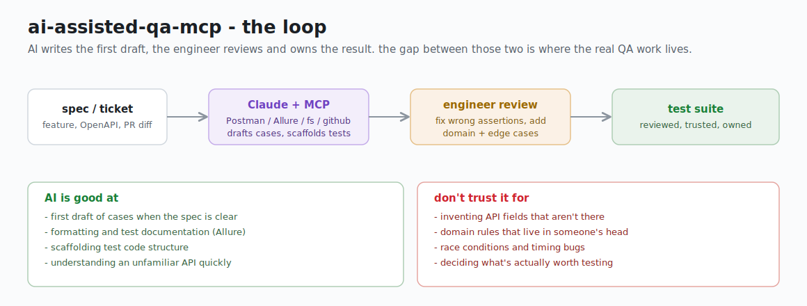

# AI-assisted QA with Claude and MCP servers

  

I've been doing QA for five-plus years, mostly backend and integration testing - REST, gRPC, Kafka, that kind of thing. About a year ago I started weaving Claude into my daily workflow, and then MCP servers made it genuinely useful rather than just a novelty.

This repo isn't a framework, it's a collection of configs, prompts, and notes from that experience. The idea is to show one working setup, not the definitive way.



## What this is (and isn't)

AI doesn't replace the thinking part of QA. It doesn't know your domain, it doesn't know which edge cases matter to your business, and it invents API fields with confidence. What it does do is handle the stuff that's tedious but not hard: drafting test cases from a description, generating the first skeleton of a test file, turning rough notes into a formatted bug report.

For me that's maybe 30-40% of a workday, and getting a solid draft in two minutes instead of twenty adds up.

The workflow I landed on: AI generates a first draft, I review and fix it, I own the result. The diff between what AI gives you and what goes into your test suite is where the actual QA work happens.

## MCP servers worth connecting for QA

MCP (Model Context Protocol) lets Claude talk directly to your tools instead of you copy-pasting back and forth. Here's what I actually use and why.

### Postman MCP

Probably the most immediately useful one. You can point Claude at your Postman workspace and ask it to generate test scripts for a collection, review existing tests, or draft new requests from a spec.

What it's good for: generating the first version of test scripts for a new endpoint, checking if existing tests cover negative cases, querying collection structure.

What to watch out for: it generates plausible-looking assertions that may not match your actual API behavior. Always run the tests and check what they're actually asserting.

### Allure MCP

Allure is where my test documentation lives. With the MCP connected, Claude can read existing test cases, help write new ones in the right format, and search across the history.

The thing that saved me the most time: giving Claude a feature description and existing test cases from a similar feature, then asking it to draft test cases for the new one in the same style. The output is rough, but it's 80% of the way there.

### Filesystem MCP

Simple but useful. Lets Claude read your local spec files, test files, and docs without you pasting them in. I point it at my project directory and it can look at OpenAPI specs, existing test code, and readme files directly.

Worth setting up even if you're not using the other MCPs - it makes every other prompt better because Claude has actual context.

### GitHub MCP

For reading PR diffs, checking what changed in a feature branch, looking at related issues. Useful when you're doing exploratory testing on a new feature and want to understand what actually changed in the codebase.

## Setup

Config file goes at `.mcp.json` in your project root (or `~/.claude/mcp.json` for global). See the included `.mcp.json` for a working example with all four servers.

You'll need:
- Claude Code installed (`npm install -g @anthropic-ai/claude-code` or via the Claude desktop app)
- API keys / tokens for each server (Postman API key, Allure token, GitHub token)
- Node.js for most MCP server packages

After adding the config, restart Claude Code. Run `/mcp` in the Claude Code terminal to verify connections.

## Workflow: how I actually use this

Full breakdown is in `examples/workflow.md`, but the short version:

**Test design** - new feature comes in, I grab the spec or ticket description, run it through the `prompts/test-design.md` template, get a draft of test cases in a few minutes. Then I go through each one and decide what stays, what changes, what's missing.

**Test documentation** - for Allure specifically, I paste in the test cases and ask Claude to format them with proper steps, expected results, and metadata tags. Boring but necessary work, now takes minutes.

**API test scaffolding** - when a new endpoint lands, I feed the OpenAPI spec to Claude and ask for a pytest skeleton. The structure is usually correct, the assertions need work.

**Bug reporting** - I keep rough notes while testing, then use `prompts/bug-report.md` to turn them into a proper report with reproduction steps and environment info.

## Where AI helps and where it doesn't

Helps:
- First draft of test cases when you have a clear spec
- Formatting and documentation work
- Understanding unfamiliar APIs or protocols quickly
- Generating variations of existing tests

Doesn't help (or actively misleads):
- Domain-specific edge cases - it doesn't know your business rules
- Non-obvious integration behaviors - how two services interact in your specific setup
- Performance and load testing strategy
- Deciding what's actually important to test

See `notes/where-not-to-trust-ai.md` for specifics.

## Files in this repo

```
.mcp.json                          MCP server config
prompts/
  test-design.md                   Prompt: feature description -> test case draft
  bug-report.md                    Prompt: rough notes -> bug report
  api-test-from-spec.md            Prompt: OpenAPI spec -> pytest/Postman scaffold
examples/
  test-cases-from-feature.md       Example: login with OTP feature -> generated test cases
  workflow.md                      A typical day with AI in the QA loop
notes/
  where-not-to-trust-ai.md         Honest notes on where this breaks down
```

## Stack I'm running this with

Python, pytest, Postman, Allure, Kafka (for event-driven stuff), REST and gRPC. Most of the prompts and examples are backend-focused. If you're doing frontend or mobile testing, some of this will need adapting.

## Contributing / feedback

This is a personal repo, not an open-source project. But if something's wrong or outdated, feel free to open an issue.
